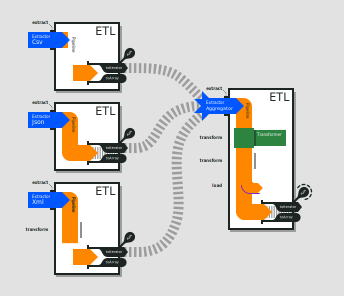

# Wizaplace PHP ETL (WP-ETL)

[](https://packagist.org/packages/marquine/php-etl)

Extract, Transform and Load data using PHP.



## Changelog
See the changelog [here](changelog.MD)

## Installation
In your application's folder, run:
```shell
composer require wizaplace/php-etl
```

## Example
In the example below, we will extract data from a csv file, trim white spaces from the name and email columns and then insert the values into the users table:
```php
use Wizaplace\Etl\Etl;
use Wizaplace\Etl\Extractors\Csv;
use Wizaplace\Etl\Transformers\Trim;
use Wizaplace\Etl\Loaders\Insert;
use Wizaplace\Etl\Database\Manager;
use Wizaplace\Etl\Database\ConnectionFactory;

$connexionFactory = new ConnectionFactory();
$manager = new Manager($connexionFactory);
$etl = new Etl();
$extractor = new Csv();
$transformer = new Trim();
$loader = new Insert($manager);

$etl->extract($extractor, '/path/to/users.csv')
    ->transform($transformer, ['columns' => ['name', 'email']])
    ->load($loader, 'users')
    ->run();
```

The library is fully compatible with any PHP project.
For instance, with Symfony, you can fully benefit from the autowiring. On the following example, you enable it on the
main ETL object, with the _shared_ parameter to _false_ in order to have the possibility to get
different instance of the ETL (optionnal).

_services.yaml_
```yaml
    Wizaplace\Etl\Etl:
        shared: false
```
## Documentation
The documentation is available in a subfolder of the repo, [here](docs/README.md).

## License
WP-ETL is licensed under the [MIT license](http://opensource.org/licenses/MIT).

## Origin of the project
This project is a fork and an improvement of the [marquine/php-etl](https://github.com/leomarquine/php-etl) project by [Leonardo Marquine](https://github.com/leomarquine/php-etl).
